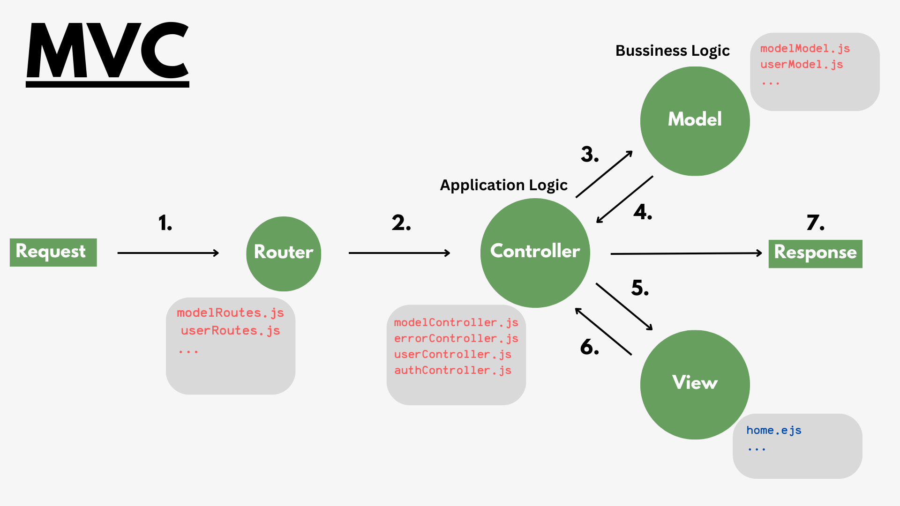
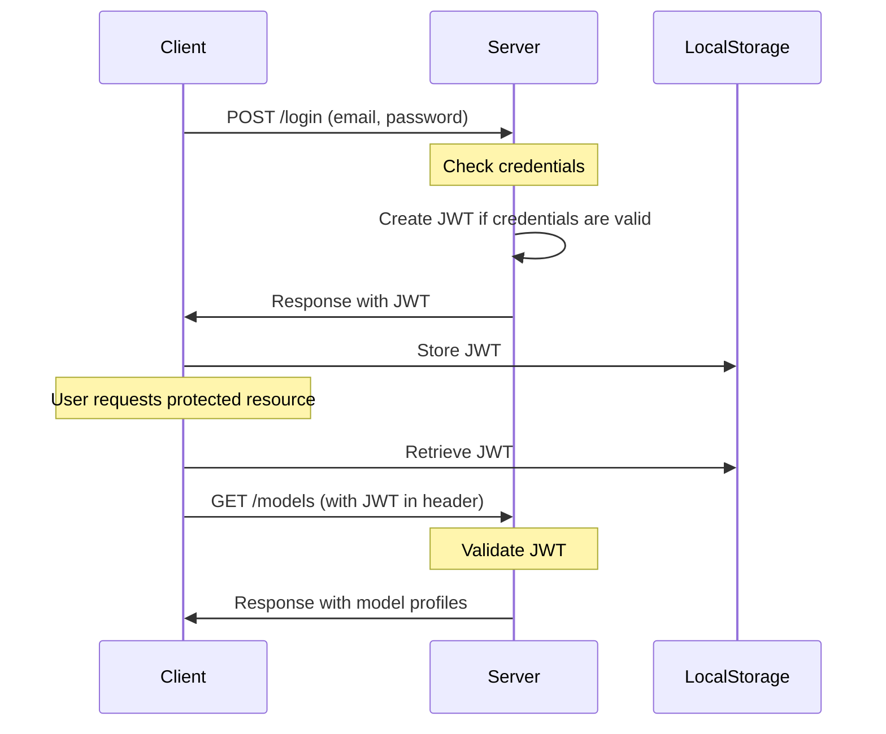

# Scout Model Search REST-API

## Table of Contents

1. [Project Overview](#project-overview)
2. [Getting Started](#getting-started)
   - [Prerequisites](#prerequisites)
   - [Installation](#installation)
   - [Configuration](#configuration)
3. [Architecture](#architecture)
   - [MVC Structure](#mvc-architecture-and-logic-separation)
   - [Database Schema](#database-schema)
4. [API Documentation](#api-documentation)
   - [Endpoints](#endpoints)
   - [Authentication](#authentication)
5. [Key Features](#key-features)
   - [Error Handling](#error-handling)
   - [Email Service (Nodemailer)](#email-service-nodemailer)
   - [Advanced API Features](#advanced-api-features)
6. [Security Measures](#security-measures)


## Project Overview

[Brief description of your project]

Structure:
```
C:\Express-Rest-API-ScoutModel
├── app.js
├── config.env
├── controllers_OR_routehandlers
| ├── authController.js
| ├── errorController.js
| ├── handlerFactory.js
| ├── modelController.js
| └── userController.js
├── dev-data
| ├── complete-model-profiles.json
| ├── models-simple.json
| └── script.js
├── models
| ├── modelModel.js
| └── userModel.js
├── package-lock.json
├── package.json
├── routes
| ├── modelRoutes.js
| └── userRoutes.js
├── server.js
├── utils
| ├── apiFeatures.js
| ├── appError.js
| ├── catchAsyncFunction.js
| └── email.js
└── views
└── emails
├── passwordReset.ejs
└── welcome.ejs
```
## Getting Started

### Prerequisites

- Node.js 
- MongoDB 
- Mail Trap
- Mail Gun (optional)

### Installation

```bash
git clone https://github.com/jonathancs50/Express-Rest-API-ScoutModel.git
cd [your-project-name]
npm install
```

### Configuration

1. Create a `.env` file in the root directory.
2. Add the following environment variables:

``` 
NODE_ENV=development
PORT=3000
PASSWORD=your_mongoDB_password
DATABASE=your_mongodb_connection_string

JWT_SECRET=The-JWT-Secret-code-you-choose
JWT_EXPIRES_IN=3600000
JWT_COOKIE_EXPIRES_IN=3600000

EMAIL_SERVICE=your_email_service
EMAIL_USERNAME=your_email_username
EMAIL_PASSWORD=your_email_password

MAILGUN_API_KEY=your_mailgun_api_key
MAILGUN_DOMAIN=your_mailgun_domain
```

3. Adjust the values according to your setup.

# Database Setup Guide

This section will help you set up and populate the database for our project. We'll be adding both model and user data to get you started quickly.

## Steps to Set Up Your Database

### 1. Prepare Your Data Files

In the `dev-data` folder of the project, you'll find two important files:
- `complete-model-profiles.json`: Contains data for models
- `users.json`: Contains data for users

These files already have some sample data. You can edit them to add your own data if you like.

### 2. Set Up Your Environment

   1. Open a terminal or command prompt
   2. Navigate to the project folder
   3. Run `npm install` to install all necessary packages if you have not done it yet.

### 3. Populate the Database

To add the sample data to your database:

1. In the terminal, make sure you're in the project folder
2. Run this command:
   ```
   node dev-data/script.js --import
   ```
3. Wait for the "Data successfully loaded" message

That's it! Your database now has sample models and users.

### 4. Clear the Database (Optional)

If you ever want to start fresh and remove all data:

1. In the terminal, make sure you're in the project folder
2. Run this command:
   ```
   node dev-data/script.js --delete
   ```
3. Wait for the "DB deleted!" message

## What's Next?

Now that your database is set up with sample data, you can start using the API. Below is the POST MAN documentation on how to use different features, including the password reset functionality.

# MVC Architecture and Logic Separation
## MVC Design

*Figure 1: Model-View-Controller (MVC) Design Pattern*

## MVC Overview
The Model-View-Controller (MVC) pattern separates an application into three components:
- **Model**: Manages data and business logic
- **View**: Handles data presentation
- **Controller**: Mediates between Model and View, processes user input and application logic

## Business Logic and Application Logic

### Business Logic

Business logic refers to the part of a software system that encodes the real-world business rules, procedures, and data processing that are specific to the organization or industry the software serves. It defines how business data is created, stored, and changed.
Examples:
- Calculating product prices based on various factors
- Determining user eligibility for a service
- Implementing a company's discount rules

### Application Logic

Application logic refers to the code that controls the functionality of the application itself, how it interacts with users, and how it manages data flow between different parts of the system.
Examples:
- Routing HTTP requests to appropriate handlers
- Managing user authentication and authorization
- Handling form submissions and input validation
- Formatting data for presentation in the user interface

The separation of business logic and application logic allows for better organization, maintainability, and scalability of software systems.

## MVC Flow For the diagram above:
1. Client request (Application Logic)
2. Router finds appropriate route (Application Logic)
3. Controller invokes Model (Application Logic calls Business Logic)
4. Model processes data (Business Logic)
5. Controller requests View (Application Logic)
6. View formats data (Presentation Logic)
7. Controller sends response (Application Logic)


## Database Schema

The Model Scout API uses MongoDB as its database, with Mongoose as the ODM (Object Document Mapper). There are two main schemas: Model and User.

### Model Schema

The Model schema represents fashion models and includes the following fields:

1. **Basic Information**
   - `name`: String (required, 5-40 characters)
   - `slug`: String
   - `celebrity`: Boolean (default: false)
   - `age`: Number (required)
   - `height`: String (required)
   - `weight`: String (required)

2. **Physical Attributes**
   - `measurements`:
     - `bust`: String
     - `waist`: String
     - `hips`: String
     - `chest`: String
   - `shoe_size`: String (required)
   - `dress_size`: String
   - `hair_color`: String (required)
   - `hair_length`: String (required)
   - `eye_color`: String (required)
   - `skin_tone`: String (required)
   - `ethnicity`: String (required)
   - `tattoos`: String (default: "None")
   - `piercings`: String (default: "None")
   - `distinctive_features`: String

3. **Professional Details**
   - `skills`: Array of Strings
   - `languages`: Array of Strings
   - `experience`:
     - `runway`: Boolean (default: false)
     - `editorial`: Boolean (default: false)
     - `commercial`: Boolean (default: false)

4. **Social Media**
   - `social_media`:
     - `instagram`: String (unique)
     - `twitter`: String (unique)
     - `facebook`: String (unique)

5. **Images**
   - `imageCover`: String (required)
   - `images`: Array of Strings

6. **Metadata**
   - `createdAt`: Date (default: current date)

## User Schema

The User schema represents system users and includes the following fields:

1. **Basic Information**
   - `name`: String (required)
   - `email`: String (required, unique, lowercase)
   - `role`: String (enum: ["user", "model", "admin"], default: "user")
   - `photo`: String

2. **Authentication**
   - `password`: String (required, minimum 8 characters, not selected by default)
   - `passwordConfirm`: String (required, validated to match password)
   - `passwordChangedAt`: Date
   - `passwordResetToken`: String
   - `passwordResetExpires`: Date

3. **Account Status**
   - `active`: Boolean (default: true, not selected by default)

4. **Metadata**
   - `createdAt`: Date (default: current date)

Both schemas use Mongoose's schema options for virtuals, allowing for additional non-persisted fields when converting to JSON or objects.
This schema design allows for comprehensive model management, user authentication, and role-based access control within the Model Scout API.

## API Documentation

### Endpoints
## Password Reset

This API provides endpoints for resetting user passwords. The process involves two steps:

1. Requesting a password reset
2. Setting a new password

### Step 1: Request Password Reset

To initiate the password reset process, send a POST request to the following endpoint:

```
POST http://127.0.0.1:3000/api/v1/users/forgotPassword
```

Include the user's email in the request body:

```json
{
  "email": "user@example.com"
}
```

#### Response

In production, this endpoint would typically send an email containing a reset token link. However, in the current development mode, the API will return the reset URL directly in the response.

Example response:

```json
{
  "status": "success",
  "message": "Token sent to email",
  "resetUrl": "http://127.0.0.1:3000/api/v1/users/resetPassword/c5b42198a5959740ab3bc5756d51636b125f98b0842595609c63246f7244e99c"
}
```

### Step 2: Reset Password

To reset the password, send a PATCH request to the URL provided in the previous step:

```
PATCH http://127.0.0.1:3000/api/v1/users/resetPassword/<reset_token>
```

Replace `<reset_token>` with the token received in the reset URL.

Include the new password and password confirmation in the request body:

```json
{
  "password": "newpassword",
  "passwordConfirm": "newpassword"
}
```

#### Response

Upon successful password reset, you will receive a confirmation message.

### Note

Please be aware that in the current development setup, the reset token URL is returned directly in the API response instead of being sent via email. This is a temporary measure for testing and development purposes. In a production environment, it is crucial to implement a secure email service to deliver the reset token to the user's registered email address.

### Authentication
I decided to use Jason Web Tokens for my project. Below shows you how I implemented in my project.
Authentication Flow:


This diagram illustrates the following steps:

1. The client sends a POST request to the server with the user's email and password.
2. The server checks if the credentials are correct and creates a JWT if they are valid.
3. The server sends the JWT back to the client in the response.
4. The client stores the JWT in local storage or cookies (represented here as "LocalStorage").
5. When the client needs to access a protected resource (like getting all models), it retrieves the JWT from storage.
6. The client sends a GET request to fetch all models, including the JWT in the request header.
7. The server validates the JWT.
8. If the JWT is valid, the server processes the request and sends back the response with all the model profiles.

## Key Features

### Error Handling
- **This project implements a clear distinction between operational and programming errors. In development mode, detailed error messages are shown to assist with debugging. However, in production mode, error messages are kept brief to avoid leaking sensitive information. This approach ensures security while providing helpful feedback during development.

### Email Functionality

This project includes email features for account creation and password recovery:

- When a new account is created, the user receives a welcome message.
- If a user forgets their password, a reset URL is sent to their email, allowing them to reset their password.

For **development mode**, we use [Mailtrap.io](https://mailtrap.io) to test email functionality. To set this up, you'll need to add your Mailtrap credentials to the `.env` file. For **production**, you can configure a real email service (like Mailgun) by providing the necessary details in the `.env` file and creating an account with your chosen email provider.

---
### Advanced API Features
- **Email password reset**
- **API Filtering**
- **API Sorting**
- **API Pagination**
- **API Aliasing**
- **Aggregation Pipeline**

## Security Measures
- **Protected Routes**
- **Rate Limiting**
- **HTTP Headers**
- **Data Sanitization**
- **Parameter Pollution Prevention**


